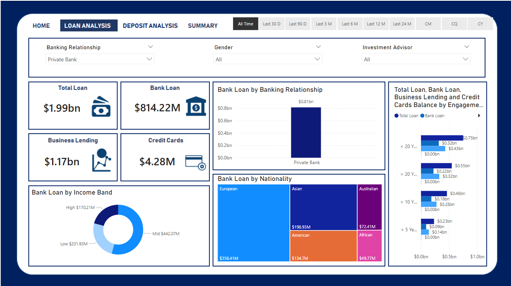
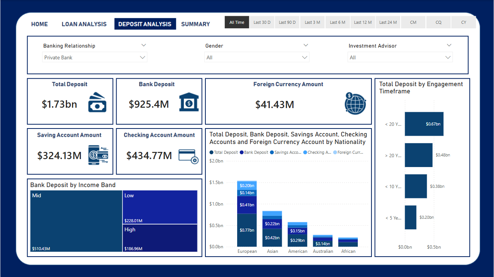

# 🏦 Banking Analytics & Performance Dashboard

> **An end-to-end data analytics project exploring customer demographics, lending risk, and deposit behavior.**

This repository contains a complete data pipeline, from Python-based Exploratory Data Analysis (EDA) to a fully interactive Power BI dashboard. The goal of this project is to provide actionable financial insights into a portfolio of 3,000 retail and business banking clients.

---

## 🔗 Live Interactive Dashboard
> **[View the Live Power BI Dashboard Here](#) *(Replace `#` with your actual Power BI public web link)* **

---

## 📊 Dashboard Previews

### 1. Overview & Home
*A high-level snapshot of total clients, total loan portfolios, and deposit amounts categorized by gender and timeframe.*


### 2. Loan Analysis
*In-depth breakdown of the $1.99bn loan portfolio, analyzing business lending vs. personal credit cards, and segmenting risk by income bands and nationality.*


### 3. Deposit Analysis
*A granular look at $1.73bn in deposits, comparing checking accounts, savings accounts, and foreign currency accounts across different engagement timeframes.*


### 4. Executive Summary
*A consolidated view of all core KPIs, including total fees, engagement accounts, and overall financial health for rapid executive decision-making.*


---

## 🛠️ Tech Stack & Tools

* **Exploratory Data Analysis (EDA):** Python (Jupyter Notebook)
* **Data Manipulation:** `pandas`, `numpy`
* **Data Visualization:** `matplotlib`, `seaborn`
* **Business Intelligence:** Microsoft Power BI

---

## 📂 Repository Structure

```text
├── data/
│   └── Banking.csv                 # Raw dataset containing 3,000 customer records
├── EDA/
│   └── BankEDA.ipynb               # Python notebook containing data cleaning and analysis
├── Power-BI/
│   ├── Banking Dashboard.pbix      # Interactive Power BI report file
│   ├── page1_home.png              # Dashboard screenshot
│   ├── page2_loan_analysis.png     # Dashboard screenshot
│   ├── page3_deposit_analysis.png  # Dashboard screenshot
│   └── page4_summary.png           # Dashboard screenshot
└── README.md                       # Project documentation

Key Analytical Insights
During the Python Exploratory Data Analysis (EDA) and dashboard development, several key features were engineered and analyzed:

Customer Segmentation: Clients were grouped into distinct Low, Mid, and High Income Bands based on their estimated annual income.

Financial Distribution: Analyzed the spread of wealth across Checking Accounts, Saving Accounts, and Foreign Currency Accounts.

Risk & Loyalty: Evaluated client profiles using a 1-to-5 Risk Weighting scale and categorized retention through distinct Loyalty Classifications (Jade, Silver, Gold, Platinum).

🚀 How to Run Locally
1. Running the Python EDA
Clone this repository to your local machine.

Ensure you have Python and Jupyter installed (e.g., via Anaconda).

Navigate to the EDA/ folder and open BankEDA.ipynb.

Run the cells to view the statistical distributions and data cleaning process.

2. Viewing the Power BI Dashboard
Download and install Microsoft Power BI Desktop. (Note: Mac users will need a Windows virtual machine like Parallels Desktop).

Open the Power-BI/Banking Dashboard.pbix file.

Interact with the filters and visuals directly on your local machine.
